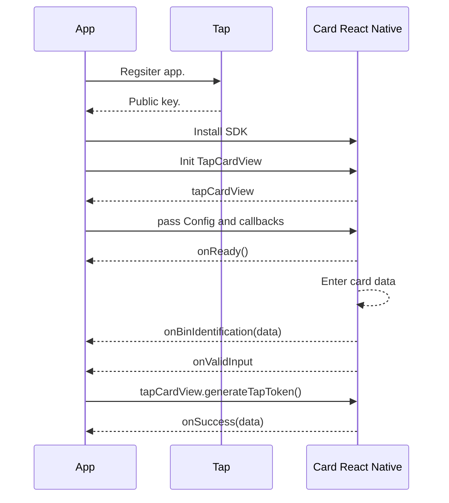

# card-react-native

Tap Card React-Native Wrapper

# Card-React-Native

We at [Tap Payments](https://www.tap.company/) strive to make your payments easier than ever. We as a PCI compliant company, provide you a from the self solution to process card payments in your iOS apps.

# Steps overview


# Get your Tap keys

You can always use the example keys within our example app, but we do recommend you to head to our [onboarding](https://register.tap.company/sell) page. You will need to register your `bundle id` to get your `Tap Key` that you will need to activate our `Card SDK`.

# Installation

We got you covered, `card-react-native` can be installed with all possible technologies.

## Node modules

```sh
npm install card-react-native
```

```sh
yarn install card-react-native
```

Then run in your terminal

```swift
cd ios
pod install
pod update
```

# Import the dependency
```Ts
import TapCardView from ‘card-react-native’;
```

# Simple integration
## Simple widget initialisation
```Ts
function MinRequirement() {
  const testRef =
    React.useRef<ITapCardViewInputRef>() as MutableRefObject<ITapCardViewInputRef>;

  return (
    <View
      style={{
        flex: 1,
        alignItems: 'center',
        justifyContent: 'center',
      }}
    >
      <TapCardView
        onSuccess={(tokenValue) => {
          console.log(
            '🚀 ~ file: HomeScreen.tsx:136 ~ HomeScreen ~ tokenValue:',
            tokenValue
          );
        }}
        ref={cardSdkRef}
        style={{ width: '100%' }}
        config={{
          merchant: {
            id: '',
          },
          order: {
            amount: 1,
            currency: TapCurrencyCode.SAR,
          },
          operator: {
            publicKey: 'pk_test_YhUjg9PNT8oDlKJ1aE2fMRz7',
          },
          scope: Scope.Authenticate,
          customer: {
            nameOnCard: 'Tap Payments',
            editable: true,
            name: [
              {
                first: 'Tap',
                lang: Locale.en,
                middle: 'Company',
                last: 'Payments',
              },
            ],
            contact: {
              phone: {
                number: '88888888',
                countryCode: '+965',
              },
              email: 'tappayments@tap.company',
            },
          },
        }}
        onInvalidInput={(invalidInput: boolean) => {
          console.log(
            '🚀 ~ file: HomeScreen.tsx:145 ~ HomeScreen ~ invalidInput:',
            invalidInput
          );
        }}
      />
    </View>
  );
}
```
## Generate Token
```Ts
const cardSdkRef =
    React.useRef<ITapCardViewInputRef>() as MutableRefObject<ITapCardViewInputRef>;
cardSdkRef.current.generateToken();
```

# Advanced Integration

## Advanced configuration initiliasation
```Ts
const config = React.useMemo(() => {
    return {
      merchant: {
        id: '',
      },
      order: {
        reference: '',
        amount: 1,
        currency: TapCurrencyCode.SAR,
        description: '',
        id: '',
        metadata: {},
      },
      invoice: {
        id: 'Map to authenticate.reference.invoice',
      },
      post: {
        url: 'Map to authenticate.reference.post',
      },
      purpose: Purpose.BillingTransaction,
      operator: {
        publicKey: 'pk_test_YhUjg9PNT8oDlKJ1aE2fMRz7',
      },
      scope: Scope.Authenticate,
      customer: {
        nameOnCard: 'Tap Payments',
        editable: true,
        id: '',
        name: [
          {
            first: 'Tap',
            lang: Locale.en,
            middle: 'Company',
            last: 'Payments',
          },
        ],
        contact: {
          phone: {
            number: '88888888',
            countryCode: '+965',
          },
          email: 'tappayments@tap.company',
        },
      },
      acceptance: {
        supportedSchemes: [
          SupportedSchemes.AMEX,
          SupportedSchemes.MASTERCARD,
          SupportedSchemes.VISA,
          SupportedSchemes.MADA,
        ],
        supportedFundSource: [
          SupportedFundSource.Debit,
          SupportedFundSource.Credit,
        ],
        supportedPaymentAuthentications: [
          SupportedPaymentAuthentications.secured,
        ],
      },
      fieldsVisibility: {
        card: { cardHolder: true, cvv: true },
      },
      interface: {
        loader: true,
        locale: Locale.en,
        theme: Theme.dark,
        edges: Edges.curved,
        cardDirection: Direction.ltr,
        colorStyle: ColorStyle.colored,
        powered: true,
      },
      features: {
        alternativeCardInputs: {
          cardNFC: true,
          cardScanner: true,
        },
        customerCards: {
          saveCard: true,
          autoSaveCard: true,
        },
        acceptanceBadge: true,
      },
    };
  }, []);
```
## Advanced widget initialisation
```Ts
<View
        // eslint-disable-next-line react-native/no-inline-styles
        style={{
          flex: 1,
          alignItems: 'center',
          justifyContent: 'center',
        }}
      >
        <TapCardView
          onSuccess={(tokenValue) => {}}
          ref={cardSdkRef}
          style={{ width: '100%' }}
          config={config}
          onHeightChange={() => {}}
          onReady={() => {}}
          onFocus={() => {}}
          onBinIdentification={(binIdentification: Object) => {}}
          onInvalidInput={(invalidInput: boolean) => {}}
          onError={(error: object) => {}}
        />
      </View>
```
# Main input documentation
To make our sdk as dynamic as possible, we accept the input in a form of a `dictionary` . We will provide you with a sample full one for reference.
It is always recommended, that you generate this `dictionary` from your server side, so in future if needed you may be able to change the format if we did an update.

|Configuration|Description | Required | Type| Sample
|--|--|--| --|--|
| operator| This is the `Key` that you will get after registering you bundle id. | True  | `String`| `let operator  {publicKey: 'pk_test_YhUjg9PNT8oDlKJ1aE2fMRz7'}` |
| scope| Defines the intention of using the `Card-React-native`. | True  | `Scope`| ` let scope = Scope.Authenticate`|
| purpose| Defines the intention of using the `Token` after generation. | True  | `String`| ` let purpose = "Transaction"` |
| order| This is the `order id` that you created before or `amount` and `currency` to generate a new order.   It will be linked this token. | True  | `Order`| ` let order: = { amount: 1, currency: TapCurrencyCode.SAR, description: '', id: '', , reference : ''}` |
| invoice| This is the `invoice id` that you want to link this token to if any. | False  | `Invoice`| ` let invoice = {"id":""}` |
| merchant| This is the `Merchant id` that you will get after registering you bundle id. | True  | `Merchant`| ` let merchant = {"id":""}` |
| customer| The customer details you want to attach to this tokenization process. | True  | `Customer`| ` let customer = {"id":"", "name":{{"lang":"en","first":"TAP","middle":"","last":"PAYMENTS"}}, "nameOnCard":"TAP PAYMENTS", "editble":true, "contact":{"email":"tap@tap.company", "phone":{"countryCode":"+965","number":"88888888"}}}` |
| features| Some extra features that you can enable/disable based on the experience you want to provide.. | False  | `Features`| ` let features = {"alternativeCardInputs":{ "cardScanner":true,"cardNFC":false}, "acceptanceBadge":true, "customerCards":{"saveCard":false, "autoSaveCard":false}`|
| acceptance| The acceptance details for the transaction. Including, which card brands and types you want to allow for the customer to tokenize/save. | False  | `Acceptance`| ` let acceptance = {"supportedSchemes":{ SupportedBrands.AMEX, SupportedBrands.MASTERCARD, SupportedBrands.VISA, SupportedBrands.MADA,}, "supportedFundSource":{"CREDIT","DEBIT"}, "supportedPaymentAuthentications":["3DS"]}`|
| fields| Needed to define visibility of the optional fields in the card form. | False  | `fieldVisibility`| ` let fieldVisibility ={ "card":{"cardHolder":true}}` |
| interface| Needed to defines look and feel related configurations. | False  | `Interface`| ` let interface = {locale: Locale.en, theme: Theme.dark, edges: Edges.curved, cardDirection: Direction.ltr, colorStyle: 'monochrome', powered: true, "loader": true}` |
| post| This is the `webhook` for your server, if you want us to update you server to server. | False  | `Post`| ` let post = {"url":""}` |

## Documentation per variable

 - operator:
	 - Responsible for passing the data that defines you as a merchant within Tap system.
 - operator.publicKey:
	 - A string, which you get after registering the app bundle id within the Tap system. It is required to correctly identify you as a merchant.
	 - You will receive a sandbox and a production key. Use, the one that matches your environment at the moment of usage.
 - scope:
	 - Defines the intention of the token you are generating.
	 - When the token is used afterwards, the usage will be checked against the original purpose to make sure they are a match.
	 - Possible values:
		 -  `Token` : This means you will get a Tap token to use afterwards.
		 - `AuthenticatedToken` This means you will get an authenticated Tap token to use in our charge api right away.
		 - `SaveToken` This means you will get a token to use multiple times with authentication each time.
		 - `SaveAuthenticatedToken` This means you will get an authenticated token to use in multiple times right away.
 - purpose:
	 - Defines the intention of using the `Token` after generation.
	 - Possible values:
		 - `Transaction` Using the token for a single charge.
		 - `Milestone Transaction` Using the token for paying a part of a bigger order, when reaching a certain milestone.
		 - `Installment Transaction` Using the token for a charge that is a part of an installement plan.
		 - `Billing Transaction` Using the token for paying a bill.
		 - `Subscription Transaction` Using the token for a recurring based transaction.
		 - `Verify Cardholder` Using the token to verify the ownership of the card.
		 - `Save Card` Using the token to save this card and link it to a certain customer.
		 - `Maintain Card` Used to renew a saved card.
 - order:
	 - The details about the order that you will be using the token you are generating within.
 - order.id:
	 - The id of the `order` if you already created it using our apis.
 - order.currency:
	 - The intended currency you will perform the order linked to this token afterwards.
 -  order.amount:
	 - The intended amount you will perform the order linked to this token afterwards.
 - order.description:
	 - Optional string to put some clarifications about the order if needed.
 - order.reference:
	 - Optional string to put a reference to link it to your system.
- order.metadata:
	 - Optional, It is a key-value based parameter. You can pass it to attach any miscellaneous data with this order for your own convenience.
 - invoice.id:
	 - Optional string to pass an invoice id, that you want to link to this token afterwards.
 - merchant.id:
	 - Optional string to pass to define a sub entity registered under your key in Tap. It is the `Merchant id` that you get from our onboarding team.
 - customer.id:
	 - If you have previously have created a customer using our apis and you want to link this token to him. please pass his id.
 - customer.name:
	 - It is a list of localized names. each name will have:
		 - lang : the 2 iso code for the locale of this name for example `en`
		 - first : The first name.
		 - middle: The middle name.
		 - last : The last name.
 - customer.nameOnCard:
	 - If you want to prefill the card holder's name field.
 - customer.editable:
	 - A boolean that controls whether the customer can edit the card holder's name field or not.
 - customer.contact.email:
	 - An email string for  the customer we are creating. At least the email or the phone is required.
 - customer.contact.phone:
	 - The customer's phone:
		 - countryCode
		 - number
 - features:
	 - Some extra features/functionalities that can be configured as per your needs.
 - features.alternativeCardInputs.cardScanner:
	 - A boolean to indicate whether or not you want to display the scan card icon.
	 - Make sure you have access to camera usage, before enabling the scanner function.
 - features.acceptanceBadge:
	 - A boolean to indicate wether or not you want to display the list of supported card brands that appear beneath the card form itself.
 - features.customerCards.saveCard:
	 - A boolean to indicate wether or not you want to display the save card option to the customer.
	 - Must be used with a combination of these scopes:
		 - SaveToken
		 - SaveAuthenticatedToken
 - features.customerCards.autoSave:
	 - A boolean to indicate wether or not you want the save card switch to be on by default.
- acceptance:
	- List of configurations that control the payment itself.
- acceptance.supportedSchemes:
	- A list to control which card schemes the customer can pay with. For example:
		- AMERICAN_EXPRESS
		- VISA
		- MASTERCARD
		- MADA
		- OMANNET
- acceptance.supportedFundSource:
	- A list to control which card types are allowed by your customer. For example:
		- DEBIT
		- CREDIT
- acceptance.supportedPaymentAuthentications:
	- A list of what authentication techniques you want to enforce and apple. For example:
		- 3DS
- fieldVisibility.card.cardHolder:
	- A boolean to indicate wether or not you want to show/collect the card holder name.
- interface.loader:
	- A boolean to indicate wether or not you want to show a loading view on top of the card form while it is performing api requests.
- interface.locale:
	- The language of the card form. Accepted values as of now are:
		- en
		- ar
- interface.theme:
	- The display style of the card form. Accepted values as of now are:
		- light
		- dark
		- dynamic // follow the device's display style
- interface.edges:
	- How do you want the edges of the card form to. Accepted values as of now are:
		- curved
		- flat
- interface.cardDirection:
	- The layout of the fields (card logo, number, date & CVV) within the card element itself. Accepted values as of now are:
		- ltr // fields will inflate from left to right
		- rtl // fields will inflate from right to left
		- dynamic // fields will inflate in the locale's direction
- interface.powered:
	- A boolean to indicate wether or not you want to show powered by tap.
	- Note, that you have to have the permission to hide it from the integration team. Otherwise, you will get an error if you pass it as false.
- interface.colorStyle:
	- How do you want the icons rendered inside the card form to. Accepted values as of now are:
		- colored
		- monochrome

# TapCardView Callbacks

callbacks that allows integrators to get notified from events fired from the `TapCardView`.

```Ts
@objc public protocol TapCardViewDelegate {
    /// Will be fired whenever the card is rendered and loaded
    onReady={() => {}}
    /// Will be fired once the user focuses any of the card fields
    onFocus={() => {}}
    /// Will be fired once we detect the brand and related issuer data for the entered card data
    /** - Parameter data: will include the data in JSON format. example :
     *{
        "bin": "424242",
        "bank": "",
        "card_brand": "VISA",
        "card_type": "CREDIT",
        "card_category": "",
        "card_scheme": "VISA",
        "country": "GB",
        "address_required": false,
        "api_version": "V2",
        "issuer_id": "bnk_TS02A5720231337s3YN0809429",
        "brand": "VISA"
     }*     */
     onBinIdentification={(binIdentification: Object) => {}}
    /// Will be fired whenever the validity of the card data changes.
    /// - Parameter invalid: Will be true if the card data is invalid and false otherwise.
       onInvalidInput={(invalidInput: boolean) => {}}
    /**
        Will be fired whenever the card sdk finishes successfully the task assigned to it. Whether `TapToken` or `AuthenticatedToken`
     - Parameter data: will include the data in JSON format. For `TapToken`:
     {
         "id": "tok_MrL97231045SOom8cF8G939",
         "created": 1694169907939,
         "object": "token",
         "live_mode": false,
         "type": "CARD",
         "source": "CARD-ENCRYPTED",
         "used": false,
         "card": {
             "id": "card_d9Vj7231045akVT80B8n944",
             "object": "card",
             "address": {},
             "funding": "CREDIT",
             "fingerprint": "gRkNTnMrJPtVYkFDVU485Gc%2FQtEo%2BsV44sfBLiSPM1w%3D",
             "brand": "VISA",
             "scheme": "VISA",
             "category": "",
             "exp_month": 4,
             "exp_year": 24,
             "last_four": "4242",
             "first_six": "424242",
             "name": "AHMED",
             "issuer": {
                "bank": "",
                "country": "GB",
                "id": "bnk_TS07A0720231345Qx1e0809820"
            }
         },
         "url": ""
     }
     */
    onSuccess={(tokenValue) => {}}
    /// Will be fired whenever there is an error related to the card connectivity or apis
    /// - Parameter data: includes a JSON format for the error description and error
    onError={(error: object) => {}}
    /// Will be fired whenever the card element changes its height for your convience
    /// - Parameter height: The new needed height
    onHeightChange={(height) => {}}

}
```
